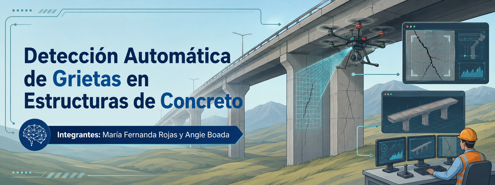

# Detección Automática de Grietas en Estructuras de Concreto

## Autores

María Fernanda Rojas, Angie Nicole  Boada

## Objetivo

Desarrollar un modelo de aprendizaje de máquina, capaz de clasificar de manera automatizada imágenes de superficies de concreto, determinando la presencia o ausencia de grietas estructurales.

## Conjunto de Datos

El proyecto utiliza un conjunto de datos compuesto por imágenes de superficies de concreto distribuidas en dos clases:

- Sin grieta
- Con grieta

Las imágenes originales fueron sometidas a una conversión a escala de grises, redimensionamiento a **28x28 píxeles**, normalización de los valores del píxel y aplanamiento en vectores de **784 características**.

### Fuente del Conjunto de Datos

[Surface Crack Detection de Kaggle](https://www.kaggle.com/datasets/arunrk7/surface-crack-detection/data).

## Modelos Implementados
Aprendizajes Supervisados:

- Decision Tree 
- Random Forest
- Support Vector Machines - SVM
- Deep Learning
  
Aprendizajes No Supervisados y Reducción de Dimensionalidad:

- K-Means
- DBSCAN
- Principal Component Analysis - PCA

## Descripción del proyecto

Este proyecto aplica diversas técnicas de aprendizaje automático para la clasificación binaria de imágenes de concreto, con el fin de optimizar la inspección de infraestructuras.

En la primera fase, se evaluaron modelos supervisados como **Decision Tree**, **Random Forest**, **SVM** y arquitecturas **Deep Learning**. Estos algoritmos fueron entrenados utilizando el conjunto de datos etiquetado para identificar y aprender los patrones geométricos y de textura asociados a las fallas estructurales.

En la segunda fase, se exploraron enfoques de aprendizaje no supervisado y reducción de dimensionalidad. Se implementó **PCA** para reducir las imágenes de **784 características** a **2 componentes principales**, facilitando la visualización y el análisis de la varianza del dataset en un plano bidimensional. Sobre este espacio reducido, se aplicaron los algoritmos **KMeans** y **DBSCAN** para evaluar la formación de agrupamientos naturales y la distribución de los datos sin etiquetas previas.

## Enlaces

- Notebook del proyecto: [Proyecto_APMaquina.ipynb](Proyecto_APMaquina.ipynb)
- Presentación: [diapositivas.pdf](diapositivas.pdf)
- Video de sustentación: [Detección Automática de Grietas en Estructuras de Concreto](https://www.youtube.com/watch?v=Xj-fkqQEVDM)]
- Repositorio: [deteccion-grietas-concreto-ml](https://github.com/mfrvrojas15-design/deteccion-grietas-concreto-ml)

## Estructura del Repositorio

- `Proyecto_APMaquina.ipynb`: notebook principal del proyecto.
- `banner.png`: imagen principal del proyecto.
- `diapositivas.pdf`: presentación del proyecto.
- `README.md`: descripción general del proyecto.
